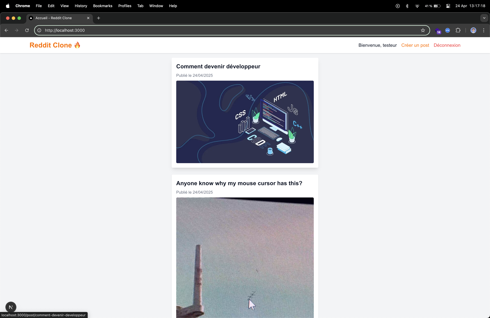

# 🚀 Reddit Clone - Fullstack App

Un mini-clone de Reddit développé avec **Strapi (Headless CMS)** en backend et **Next.js + TailwindCSS** en frontend.  
Les utilisateurs peuvent s'inscrire, se connecter, créer des posts (texte, image ou vidéo) et commenter les publications.



---

## ⚙️ Fonctionnalités

- 🔐 **Authentification** :
  - Inscription & Connexion via l'API Strapi.
  - Gestion du JWT (localStorage).

- 📝 **Création de Post** :
  - Titre, contenu, upload d'image ou vidéo.
  - Publication immédiate.

- 🖼️ **Affichage des Posts** :
  - Page d'accueil type Reddit : feed des posts.
  - Affichage conditionnel : média OU texte.

- 💬 **Commentaires** :
  - Formulaire pour ajouter un commentaire (public).
  - Affichage des commentaires sur la page détail.

- 🎨 **UI/UX** :
  - Design responsive avec TailwindCSS.
  - Layout structuré (Header, Footer, Main Content).

---

## 🚀 Installation & Lancement

### 1️⃣ Cloner le projet

```bash
git clone https://github.com/ton-repo/reddit-clone.git
cd reddit-clone
```

### 2️⃣ Backend - Strapi

```bash
cd back
npm install
npm run develop
```
Accès à Strapi ➜ http://localhost:1337/admin

### 3️⃣ Frontend - Next.js
```bash
cd front
npm install
npm run dev
```
Accès ➜ http://localhost:3000

### 📚 Technologies utilisées
- Strapi v5 (Headless CMS)
- Next.js 14
- TailwindCSS
- Axios (requêtes API)
- qs (gestion des queries)
- TypeScript

